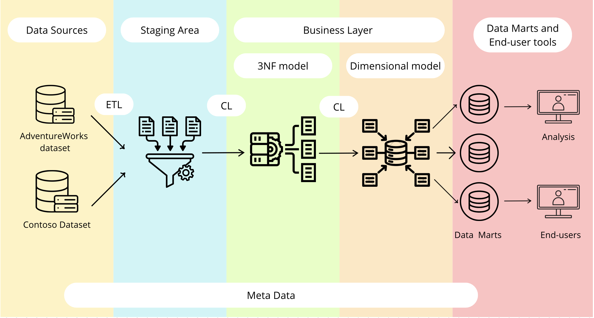

# Retail-Data-Warehouse-Project
I built a retail Data Warehouse integrating AdventureWorks and Contoso datasets. Designed SA, 3NF, and star schema layers with ETL, SCD2, and incremental loading. Enabled analysis of sales, cost, and profit across customers, products, and regions for business insights.

The goal of the project is to design and build a scalable, analytical data platform that enables efficient reporting and supports data-driven business decisions.
The architecture follows a hybrid approach:
3NF (Inmon) for integration and data consistency
Dimensional Model (Kimball) for analytics and reporting
The complete data flow is:

