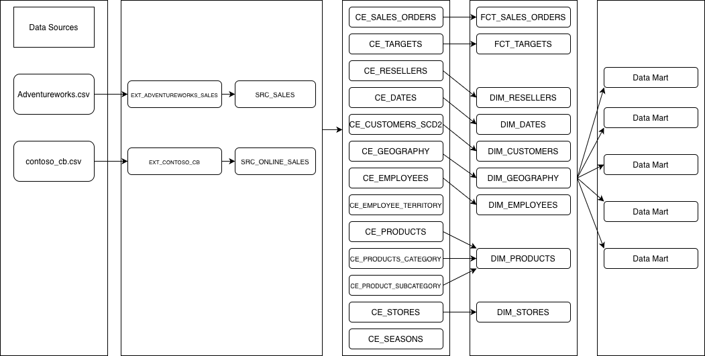
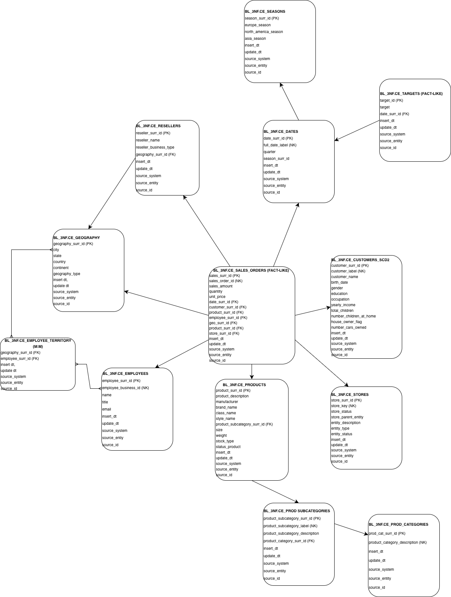
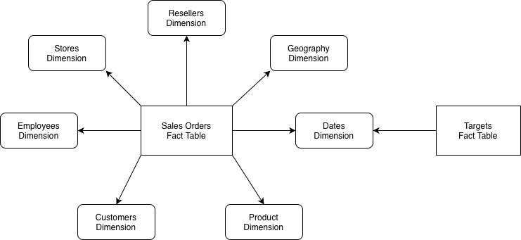

# Retail-Data-Warehouse-Project
I built a retail Data Warehouse integrating AdventureWorks and Contoso datasets. Designed SA, 3NF, and star schema layers with ETL, SCD2, and incremental loading. Enabled analysis of sales, cost, and profit across customers, products, and regions for business insights.

The full documentation can be found in the Business_Template file.

The goal of the project is to design and build a scalable, analytical data platform that enables efficient reporting and supports data-driven business decisions.
The architecture follows a hybrid approach:
* 3NF (Inmon) for integration and data consistency
* Dimensional Model (Kimball) for analytics and reporting
  
The complete data flow is:

Modern retail companies operate across multiple channels (online, resellers, stores) and generate large volumes of transactional and customer data.
However, raw source data is denormalized, redundant, difficult to analyze historically.

This project solves these issues by implementing a centralized DWH that:
* Integrates multiple data sources
* Eliminates inconsistencies
* Preserves historical changes
* Enables advanced analytics (sales, cost, profit, performance)

## The project uses two independent source systems:
1. AdventureWorks
- Sales transactions
- Products, resellers, employees
- Sales territories
- Targets (planning data)
2. Contoso Retail
- Online sales transactions
- Customer demographics
- Product hierarchy
- Geography and store data
  
These sources are integrated into a unified model in the DWH.

## Layers
Staging Layer (SA)
- Loads raw data from CSV files using file_fdw
- Performs data typing, cleansing, and deduplication
  
3NF Layer (BL_3NF)
- Stores normalized and integrated business entities
- Eliminates redundancy
- Uses surrogate keys and source tracking

Dimensional Model (BL_DM)
- Implements star schema
- Contains fact and dimension tables
- Optimized for analytical queries

## ETL pipelines
The ETL process is implemented using PL/pgSQL procedures in the BL_CL schema.

Features
- Incremental loading
- Slowly Changing Dimension Type 2 (SCD2)
- Logging using mta_etl_log
- Restartable procedures
- Default value handling (-1 records)
- Left joins to ensure data completeness

Execution

CALL bl_cl.prc_run_load_bl_3nf();

CALL bl_cl.prc_run_load_bl_dm();

(The structure of procudures can be seen in SQL files provided)

## 3rd Normalized Form Layer
The 3NF layer represents a fully normalized and integrated data model that consolidates data from multiple source systems into a single, consistent structure.

In this layer, each business entity (such as customers, products, employees, and geography) is stored in a separate table, eliminating redundancy and ensuring data integrity. Data from different sources is merged into unified entities, creating a single version of truth.

Key characteristics:
- One table per business entity
- Use of surrogate keys and natural keys
- Source traceability via source_system, source_entity, and source_id
- Support for Slowly Changing Dimensions (SCD Type 2) to preserve historical data
- Inclusion of technical attributes such as insert_dt and update_dt
  
The 3NF layer serves as a reliable, auditable foundation for downstream analytical processing.

## Dimensional Model Layer 
The Dimensional Model (DM) layer is designed for analytical querying and reporting, transforming normalized data into a star schema structure.
This layer consists of fact tables containing measurable metrics and dimension tables that provide descriptive context. The model is optimized for performance and ease of use in BI tools.

Key characteristics:
- Star schema design (fact + dimensions)
- Central fact tables (e.g., sales, targets)
- Surrounding dimension tables (customers, products, time, geography, etc.)
- Use of surrogate keys for efficient joins
- Support for SCD Type 2 in selected dimensions to maintain history
- Prepares data for fast aggregation and business analysis
  
The DM layer enables efficient querying, flexible reporting, and business insights, making it the primary layer for end users and BI tools.

